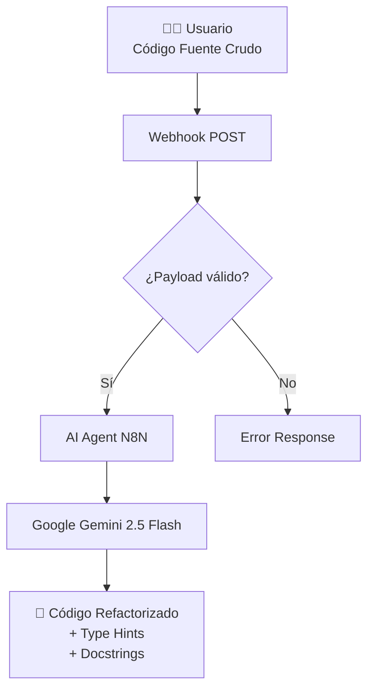
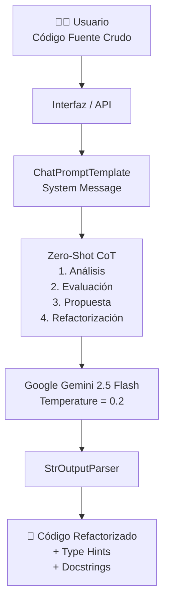

# 🚀 Asistente Inteligente de Revisión de Código
 
*Proyecto Final - Sistemas Inteligentes 1*  
*Ingeniería de Sistemas y Computación | Universidad de Caldas*
 
---
 
## 📝 Descripción del Proyecto
 
Este proyecto consiste en el desarrollo de un agente de Inteligencia Artificial diseñado para automatizar la revisión, documentación y refactorización de código fuente. El objetivo principal es reducir la deuda técnica y la carga cognitiva de los desarrolladores, aplicando principios de *Clean Code* y priorizando la simplicidad hacia una arquitectura de *Monolito Modular*.
 
El sistema fue desarrollado bajo un enfoque incremental de niveles, escalando desde un prototipo de automatización visual (Low-Code) hasta una arquitectura programática determinista basada en el razonamiento del modelo de lenguaje.
 
- **Nivel 1:** Implementación de un flujo orquestado con *N8n*.
- **Nivel 2:** Agente programático nativo construido con *LangChain* y LCEL.
---
 
## 🏗️ Arquitectura del Sistema
 
### Nivel 1 — N8n (Low-Code)
 

 
### Nivel 2 — LangChain (Code-First)
 

 
---
 
## ⚖️ Comparativa Estratégica: N8n vs. LangChain
 
Ambas herramientas resuelven el problema de interacción con modelos de lenguaje, pero presentan diferencias importantes en términos de control, rendimiento y escalabilidad.
 
| Característica | 🟢 Nivel 1: N8n (Low-Code) | 🦜 Nivel 2: LangChain (Code-First) |
|---|---|---|
| **Curva de Adopción** | Muy baja. Interfaz visual intuitiva. | Media/Alta. Requiere conocimientos de Python y LangChain. |
| **Control del Razonamiento** | Limitado al nodo AI Agent. | Control total mediante LCEL y Prompt Engineering. |
| **Latencia** | Mayor debido a la capa de automatización. | Menor al interactuar directamente con la API. |
| **Escalabilidad** | Adecuado para prototipos y automatizaciones simples. | Ideal para soluciones empresariales y producción. |
| **Testing** | Limitado. | Compatible con pruebas unitarias y CI/CD. |
| **Manejo de Errores** | Basado en flujos visuales. | Programático mediante `try/except` y parsers. |
| **Mantenibilidad** | Menor para proyectos complejos. | Alta modularidad y reutilización de componentes. |
 
---
 
## 🛠️ Tecnologías Utilizadas
 
- **Lenguaje:** Python 3.10+
- **Framework LLM:** LangChain
- **Modelo de IA:** Google Gemini 2.5 Flash
- **Proveedor de IA:** Google AI Studio
- **Integración Gemini:** `langchain-google-genai`
- **Automatización Visual:** N8n Cloud
- **Frontend:** Streamlit
- **Gestión de Variables de Entorno:** `python-dotenv`
- **Control de Versiones:** Git y GitHub
---
 
## ⚙️ Instalación y Ejecución Local
 
### 1. Clonar el repositorio y acceder a la carpeta
 
```bash
cd CodeReviewer_SistemasInteligentes
```
 
### 2. Instalar dependencias
 
```bash
pip install -r requirements.txt
```
 
### 3. Configurar variables de entorno
 
Crear un archivo `.env` en la raíz del proyecto:
 
```env
GOOGLE_API_KEY="TU_API_KEY_AQUI"
```
 
### 4. Ejecutar el agente programático
 
```bash
python main.py
```
 
### 5. Ejecutar la interfaz Streamlit (Opcional)
 
```bash
streamlit run app.py
```
 
---
 
## 📂 Estructura del Proyecto
 
```
CodeReviewer_SistemasInteligentes/
│
├── workflow/
│   └── flujo_principal.json
│
├── .env
├── dashboard.py
├── Langchain.ipynb
├── main.py
├── README.md
└── requirements.txt
```
 
---
 
## 🎯 Funcionalidades
 
- Revisión automática de código fuente.
- Detección de malas prácticas.
- Aplicación de principios Clean Code.
- Refactorización automática.
- Generación de Type Hints.
- Generación de Docstrings.
- Comparación entre enfoque Low-Code y Code-First.
- Análisis estructurado mediante Chain of Thought.
- Reducción de deuda técnica.
---
 
## 🎓 Declaración de Integridad Académica
 
La arquitectura, diseño e implementación de este proyecto fueron desarrollados por los autores como parte de la asignatura Sistemas Inteligentes I. Las herramientas de Inteligencia Artificial Generativa se utilizaron únicamente como apoyo para la validación conceptual, documentación técnica y mejora de redacción, manteniendo la autoría intelectual del trabajo académico.
 
---
 
## 👥 Autores
 
- Jhonatan David Gómez Castaño
- Esteban Ochoa Silva
*Universidad de Caldas*  
*Ingeniería de Sistemas y Computación*  
*Sistemas Inteligentes I*